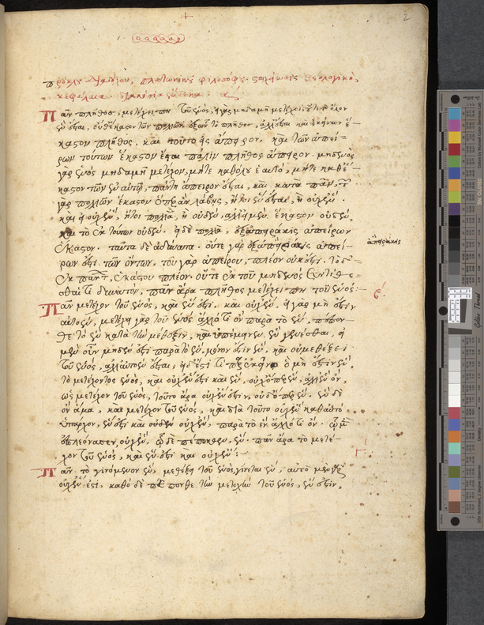
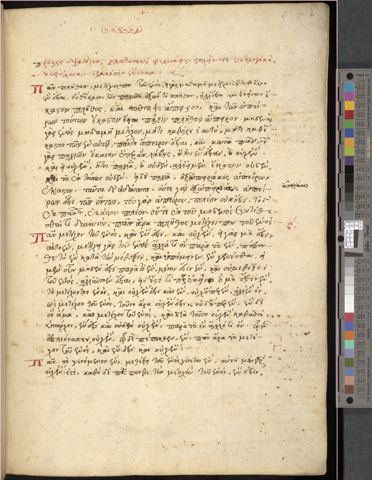

# Automatic Image Cropping

This script uses computer vision to automatically crop color bars and rulers from high resolution scans. 

## Quickstart

First, start the OpenCV component in a Docker container:

```
docker build -t crop https://github.com/johnjung/automatic_image_cropping.git
docker run --rm -it -p 5000:5000 crop start
```

Then run the cropping script itself in a separate window:

```console
$ sh crop.sh

.----. .----. .----. .----.  
| {}  }| {}  }| {_  { {__    
| .--' | .-. \| {__ .-._} }  
`-'    `-' `-'`----'`----'   
 .---. .----.  .----. .----. 
/  ___}| {}  }/  {}  \| {}  }
\     }| .-. \\      /| .--' 
 `---' `-' `-' `----' `-'    

Welcome to the preservation cropping script.

Enter input directory, e.g. /Volumes/pres/EWM/ewm-0054/Masters: 
```

The following script tests cropping settings on a specific image:

```console
$ sh test.sh <red> <green> <blue> <variation> <inputfile> <outputfile>
```

In testing mode the script draws a rectangle around the image area that
Before you begin, make sure you have all the right packages installed (requirements.txt)
 
will be left after cropping. Here's a sample image-



And here is the sample image with a bounding box-



## Parameters

### red
In an rgb pixel describing the ruler's color, the red channel amount from
0-255.

### green
In an rgb pixel describing the ruler's color, the green channel amount from
0-255.

### blue
In an rgb pixel describing the ruler's color, the blue channel amount from
0-255.

### variation
Fuzziness for color matching. If rgb values are 120 and grayvariation is set to
20, the script will search for objects between 100/100/100 and 140/140/140. 

## Contributing

Please contact the author with pull requests, bug reports, and feature
requests.

## Contributors

John Jung (Author), Kevin Song
